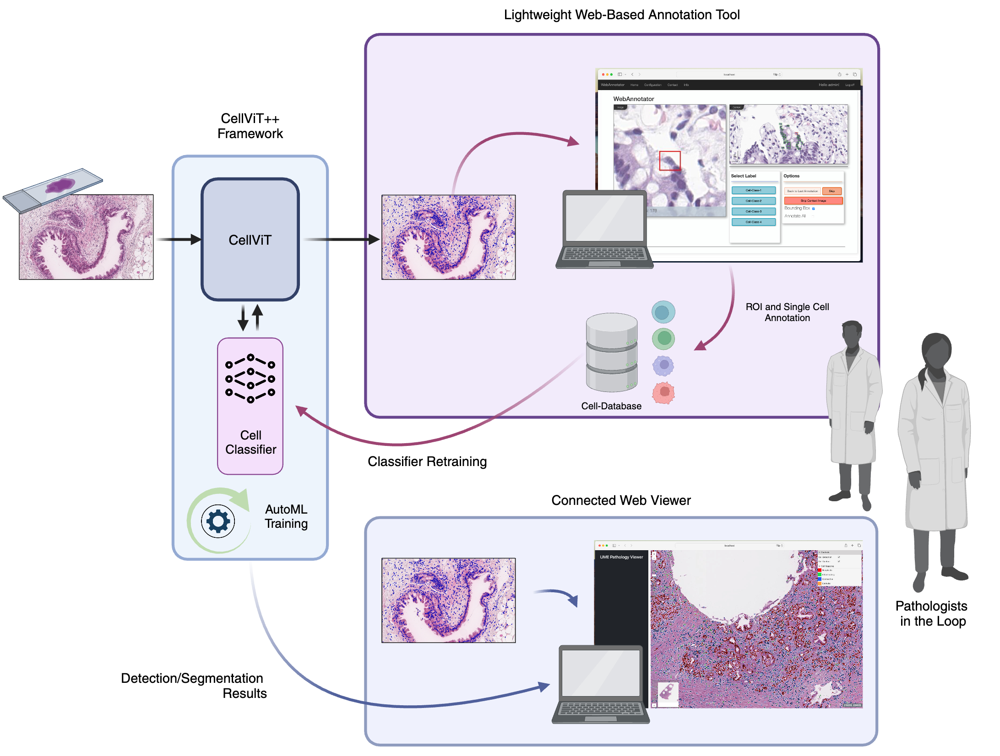

[](https://www.python.org/downloads/release/python-31014/)
[](https://github.com/psf/black)
[](https://www.codefactor.io/repository/github/tio-ikim/cellvit)
</a>
[](https://visitorbadge.io/status?path=https%3A%2F%2Fgithub.com%2FTIO-IKIM%2FCellViT)
[](https://paperswithcode.com/sota/panoptic-segmentation-on-pannuke?p=cellvit-vision-transformers-for-precise-cell)
___
<p align="center">
  
</p>

___

# CellViT++: Energy-Efficient and Adaptive Cell Segmentation and Classification Using Foundation
<div align="center">

[Key Features](#key-features) • [Installation](#installation) • [Inference](#inference) • [Examples](#examples) • [Re-training](#re-training-your-own-classifier) • [Reproducability](#reproducability) • [Viewer](#web-based-viewer) • [Annotation](#annotation-tool) • [Acknowledgements](#acknowledgements) • [Citation](#Citation)

</div>

## Key Features


#### Visualization
<div align="center">


</div>

## Installation

### Hardware Requirements

- 🚀 **CUDA-capable GPU**: A GPU with at least 24 GB VRAM (48 GB recommended for faster inference, e.g., RTX-A6000). We performed experiments using one NVIDIA A100 with 80GB VRAM.
- 🧠 **Memory**: Minimum 32 GB RAM.
- 💾 **Storage**: At least 30 GB disk space.
- 🖥️ **CPU**: Minimum of 16 CPU cores.

### Local installation


<details>
  <summary>Installation (conda + pip) - Fast</summary>


1. Create an environment
    ```bash
    conda env create -f environment_verbose.yaml
    ```
2. Activate your environment
    ```bash
    conda activate cellvit_env
    ```
3. Install pip packages
    ```bash
    pip install -r requirements.txt
    ```
4. Install pytorch for your system  
   We used the following pytorch version:
   - torch==2.2.1
   - torchaudio==2.2.1
   - torchvision==0.17.1

    You can find installation instructions regarding pytorch here: https://pytorch.org/get-started/previous-versions/

    :bulb: Even if PyTorch gets installed during environment buildup, please install it specifically for your system

    Example (but check your version please on the website!):
    ```bash
    pip install torch==2.2.2 torchvision==0.17.2 torchaudio==2.2.2 --index-url https://download.pytorch.org/whl/cu121
    ```

</details>

<details>
  <summary>Installation (conda) - Slow</summary>


1. Create an environment
    ```bash
    conda env create -f environment.yaml
    ```
    > :hourglass_flowing_sand: This procedure can take some time, on our hardware it needed around 30 min to install all packages, but this might take longer. If you want to keep track of the installation progress, you might consider using the split approach described above using **conda + pip**.

2. Activate your environment
    ```bash
    conda activate cellvit_env
    ```

3. Install pytorch for your system  
   We used the following pytorch version:
   - torch==2.2.1
   - torchaudio==2.2.1
   - torchvision==0.17.1

    You can find installation instructions regarding pytorch here: https://pytorch.org/get-started/previous-versions/

    :bulb: Even if PyTorch gets installed during environment buildup, please install it specifically for your system

    Example (but check your version please on the website!):
    ```bash
    pip install torch==2.2.2 torchvision==0.17.2 torchaudio==2.2.2 --index-url https://download.pytorch.org/whl/cu121
    ```

</details>


##### **Check your installation** 📦

After completing the above steps and activating the environment, run the following command to verify that your environment is correctly set up:

```bash
python3 check_environment.py
```
Note: If the script runs successfully, your environment is ready for use. This also already downloads the test database


##### Troubleshooting:
* **CuPY**: Multiple cupy version with pip and conda -> Remove all packages for cupy from pip (`pip uninstall cupy`) **and** conda (`conda uninstall cupy`). If you get problems with CuPY and your GPU, please uninstall all cupy packages and install the respective version for your system (CUDA) configurations. For help see here: https://docs.cupy.dev/en/stable/install.html
* We provide two environments files. The first one is the full conda export to get all packages we used to track the environment along with its dependencies (environment_full.yaml). The other one is a cleaned file that just includes important packages to get the code working (environment.yaml).

### Docker Image
The Docker Image will be released upon acceptance.

### Model Checkpoints
Checkpoints can be downloaded here (we will change to zenodo soon when the code is intended to go public) from [Google-Drive](https://drive.google.com/drive/folders/1ujtMcxAr5kYYuvnbglfYZZnRH3ZOli79?usp=sharing). They should be placed inside the `./checkpoints` folder. Classifier checkpoints are already located inside the `./checkpoints/classifier` folder.

## Framework Overview

This framework consists of 3 key components: **CellViT++ Algorithm**, **Cell Classification Module**, **Web-Based WSI Viewer**

<div align="center" style="max-width: 400px; margin: 0 auto;">
    
        <figcaption style="text-align: center; font-style: italic; padding-top: 5px;">Created with BioRender</figcaption>

</div>
We subsequently introduce all models, starting with the algorithm.

## Inference
Inference can either be performed in-memory (recommended) or with the old version (patch extraction first). We highly recommend to use the new in-memory version, as it is faster and has more options. The old script still exists for legacy reasons, but not all functionality is supported.

The model checkpoints can be downloaded from [Google-Drive](https://drive.google.com/drive/folders/1ujtMcxAr5kYYuvnbglfYZZnRH3ZOli79?usp=sharing) and should be placed in the `./checkpoint` folder. The cell classifier modules have already been provided in this repo (see classifiers inside the checkpoints folder).

Examples are given [below](#examples).

Key aspects of the inference script:

> :heavy_plus_sign: Select what you want to extract (json, geojson, graph)
> :heavy_plus_sign: Snappy compression to save storage
> :heavy_plus_sign: Single or multiple WSI processing without preprocessing

### CLI (In-Memory)
If the data is prepared, use the [`detect_cells.py`](cellvit/detect_cells.py) script inside the `cellvit` folder to perform inference:

`python3 ./cellvit/detect_cells.py --OPTIONS`

The options are listed here (use `--help` inside the terminal to get help):
```bash
usage: detect_cells.py [-h]
  --model MODEL
  [--binary | --classifier_path CLASSIFIER_PATH]
  [--gpu GPU]
  [--resolution {0.25,0.5}]
  [--enforce_amp]
  [--batch_size BATCH_SIZE]
  --outdir OUTDIR
  [--geojson]
  [--graph]
  [--compression]
  {process_wsi,process_dataset} ...

Perform CellViT inference

options:
  -h, --help            show this help message and exit
  --binary              Use this for cell-only detection/segmentation without classifier.
                        Cannot be used together with --classifier_path. (default: False)
  --classifier_path CLASSIFIER_PATH
                        Path to a classifier (.pth) to replace PanNuke classification results with a new scheme.
                        Example classifiers can be found in ./checkpoints/classifiers folder.
                        A label map with an overview is provided in each README for the respective classifier.
                        Cannot be used together with --binary. (default: None)
  --gpu GPU             Cuda-GPU ID for inference. Default: 0 (default: 0)
  --resolution {0.25,0.5}
                        Network resolution in MPP.
                        Is used for checking patch resolution such that we use the correct resolution for network.
                        We strongly recommend to use 0.25, 0.50 is deprecated and will be removed in subsequent versions.
                        Default: 0.25 (default: 0.25)
  --enforce_amp         Whether to use mixed precision for inference (enforced).
                        Otherwise network default training settings are used. Default: False (default: False)
  --batch_size BATCH_SIZE
                        Inference batch-size. Default: 8 (default: 8)
  --outdir OUTDIR       Output directory to store results. (default: None)
  --geojson             Set this flag to export results as additional geojson files for loading them into Software like QuPath. (default: False)
  --graph               Set this flag to export results as pytorch graph including embeddings (.pt) file. (default: False)
  --compression         Set this flag to export results as snappy compressed file (default: False)

required named arguments:
  --model MODEL         Model checkpoint file (.pth) that is used for inference. This is the segmentation model, usually with PanNuke nuclei classes. (default: None)

subcommands:
  Main run command for either performing inference on single WSI-file or on whole dataset

  {process_wsi,process_dataset}
```

**Process a single WSI**
```bash
process_wsi
  -h, --help            show this help message and exit
  --wsi_path WSI_PATH   Path to WSI file
  --wsi_properties WSI_PROPERTIES
                        WSI Metadata for processing, fields are slide_mpp and magnification. Provide as JSON string.
  --preprocessing_config PREPROCESSING_CONFIG
                        Path to a .yaml file containing preprocessing configurations, optional
```
**Process multiple WSI**
```bash
process_dataset
  --wsi_folder WSI_FOLDER
                        Path to the folder where all WSI are stored
  --filelist FILELIST   Filelist with WSI to process.
                        Must be a .csv file with one row 'path' denoting the paths to all WSI to process.
                        In addition, WSI properties can be provided by adding
                        two additional columns, named 'slide_mpp' and 'magnification'. Other cols are discarded.
  --wsi_extension WSI_EXTENSION
                        The extension types used for the WSI files, see configs.python.config (WSI_EXT)
  --preprocessing_config PREPROCESSING_CONFIG
                        Path to a .yaml file containing preprocessing configurations, optional
```

### Old-CLI (Deprecated)
Please do not use this, we intend to remove this version soon due to maintainability. if you still want to use it, please check out the script `python3 ./cellvit/detect_cells_disk.py --help`

### Examples

Before running the examples please download them by running:
`python3 ./cellvit/utils/download_example_files.py`
This download example files that are placed inside the [`./test_database`](/test_database) folder.

<details>
  <summary>1. Example without graphs and only json </summary>

  ```bash
  python3 ./cellvit/detect_cells.py \
    --model ./checkpoints/CellViT-SAM-H-x40-AMP.pth \
    --outdir ./test-results/x_40/minimal \
    process_wsi \
    --wsi_path ./test_database/x40_svs/JP2K-33003-2.svs
  ```

</details>

<details>
  <summary>2. Example without graphs but geojson </summary>

  ```bash
  python3 ./cellvit/detect_cells.py \
    --model ./checkpoints/CellViT-SAM-H-x40-AMP.pth \
    --outdir ./test-results/x_40/full_geojson \
    --geojson \
    process_wsi \
    --wsi_path ./test_database/x40_svs/JP2K-33003-2.svs
  ```

</details>

<details>
  <summary>3. Example with graph and compression</summary>

  ```bash
  python3 ./cellvit/detect_cells.py \
    --model ./checkpoints/CellViT-SAM-H-x40-AMP.pth \
    --outdir ./test-results/x_40/compression \
    --geojson \
    --compression \
    --graph \
    process_wsi \
    --wsi_path ./test_database/x40_svs/JP2K-33003-2.svs
  ```

</details>

<details>
  <summary>4. Example with differing mpp (0.50 instead of 0.25, using resize)</summary>

  ```bash
  python3 ./cellvit/detect_cells.py \
    --model ./checkpoints/CellViT-SAM-H-x40-AMP.pth \
    --outdir ./test-results/x20/1 \
    process_wsi \
    --wsi_path ./test_database/x20_svs/CMU-1-Small-Region.svs
  ```

</details>

<details>
  <summary>5. Metadata handover for single file (overwrite OpenSlide metadata)</summary>

  ```bash
  python3 ./cellvit/detect_cells.py \
    --model ./checkpoints/CellViT-SAM-H-x40-AMP.pth \
    --outdir ./test-results/x20/2 \
    --geojson \
    process_wsi \
    --wsi_path ./test_database/x20_svs/CMU-1-Small-Region.svs \
    --wsi_properties "{\"slide_mpp\": 0.50}"
  ```

</details>

<details>
  <summary>6. Metadata handover for tiff files (files without appropriate metadata)</summary>

  ```bash
  python3 ./cellvit/detect_cells.py \
    --model ./checkpoints/CellViT-SAM-H-x40-AMP.pth \
    --outdir ./test-results/x_40/minimal \
    process_wsi \
    --wsi_path ./test_database/x40_svs/JP2K-33003-2.svs
  ```

</details>

<details>
  <summary>7. Process an entire image folder with specific filetype</summary>

  ```bash
  python3 ./cellvit/detect_cells.py \
    --model ./checkpoints/CellViT-SAM-H-x40-AMP.pth \
    --outdir ./test-results/filelist \
    --geojson \
    process_dataset \
    --filelist ./test_database/MIDOG/example_filelist.csv
  ```

</details>

<details>
  <summary>8. Processing an entire filelist (setting properties via filelist) </summary>

  ```bash
  python3 ./cellvit/detect_cells.py \
    --model ./checkpoints/CellViT-SAM-H-x40-AMP.pth \
    --outdir ./test-results/x_40/minimal \
    process_dataset \
    --wsi_path ./test_database/x40_svs/JP2K-33003-2.svs
  ```

</details>

<details>
  <summary>9. Using a customized classifier </summary>

  ```bash
  python3 ./cellvit/detect_cells.py \
    --model ./checkpoints/CellViT-SAM-H-x40-AMP.pth \
    --outdir ./test-results/x_40/minimal \
    process_wsi \
    --wsi_path ./test_database/x40_svs/JP2K-33003-2.svs
  ```

</details>

<details>
  <summary>10. Binary cell segmentation (Cell yes or no) </summary>

  ```bash
  python3 ./cellvit/detect_cells.py \
      --model ./checkpoints/CellViT-SAM-H-x40-AMP.pth \
      --outdir ./test-results/x20/binary \
      --binary \
      --geojson \
      process_wsi \
      --wsi_path ./test_database/x20_svs/CMU-1-Small-Region.svs
  ```

</details>

## Re-training your own classifier on new data: Workflow

### 1. Detection Annotations

#### 1.1 Folder Structure
To define the detection dataset, you should have the following folder structure:
```bash
├── label_map.yaml        [optional, but recommended to keep track of your labels]
├── splits                [folder with splits]
│   ├── fold_0  
│   │   ├── train.csv
│   │   └── val.csv
│   ├── fold_1
│   │   ├── train.csv
│   ...
├── train                 [training dataset]
│   ├── images            [training images as png or jpeg]
│   │   ├── train_1.png
│   │   ├── train_2.png
│   │   ├── train_3.png
│   ...
│   ├── labels            [cell annotation as csv]
│   │   ├── train_1.csv
│   │   ├── train_2.csv
│   │   ├── train_3.csv
│   ...  
├── test                  [test dataset]  
│   ├── images
│   │   ├── test_1.png
│   │   ├── test_2.png
│   ...  
│   ├── labels
│   │   ├── test_1.csv
│   │   ├── test_2.csv
│   ...  
└── train_configs         [config files]
    └── ViT256
        ├── fold_0.yaml
        ├── fold_0_sweep.yaml
...
```
**We provide two exemplary datasets:**
- Simple: Squared 256x256 px sized images: [`./test_database/training_database/Example-Detection`](test_database/training_database/Example-Detection)
- Advanced: Non-Squared 260x288 px sized images: [`./test_database/training_database/Example-Detection-Non-Squared`](test_database/training_database/Example-Detection-Non-Squared)

#### 1.2 Dataset Requirements
- **Splits**: Training and validation splits are defined by the CSV files in the splits folder.
- **Test Images**: Separated into a dedicated test folder.
- **Image Dimensions**: Must be divisible by 32 after transformations. Images can be non-squared (see below).
  - If your image dimensions are differing from 256 x 256, you need to define this in the training configuration:
    ```yaml
    data:
      dataset: DetectionDataset
      dataset_path: ./test_database/training_database/Example-Detection-larger
      input_shape: [256, 288] # height, width
      ...
    ```
    Here, the input_shape is the shape after transformations (network input shape). We perform padding if the input images are smaller and center cropping if the images are larger as the defined input_shapes. We demonstrate this with examples in the [`./test_database/training_database/Example-Detection-Non-Squared`](test_database/training_database/Example-Detection-Non-Squared) folder with images with shape (260, 288)
  - Supported sizes for input_shape: 256, 288, 320, 352, 384, 416, 448, 480, 512, 544, 576, 608, 640, 672, 704, 736, 768, 800, 832, 864, 896, 928, 960, 992, 1024
- **Annotations**: CSV files containing x, y coordinates and labels. Labels are integers and start from 0.
- **Label Map**: Recommended to keep track of your labels (see label_map.yaml) in the folders.

### 2. Segmentation Annotations

#### 2.1 Folder Structure
Same folder structure as above for the detections, but the labels are now numpy (*.npy) files.
- labels are integers and must start at 1!!!
- Same structure as above, but the labels are .npy files and not .csv files
- We follow the HoVer-Net defined structure of the labels:
  Each numpy files contains an instance map (key: inst_map) with each cell as an unique integer starting from 1
  and a label map (key: label_map) with the cell class for each integer (shape...)
- Example is given in the following folder
- If you want to see how the labels are loaded, please check out our example notebook (plots of some exemplary labels along with the images as well as how the data is loaded and the data shape)

#### 2.2 Dataset Requirements

- **Labels**: Stored as .npy files (NumPy arrays), inside there needs to be a dictionary with two keys:
  - **inst_map**: Instance map with each cell as a unique integer starting from 1 (0 = background), shape H x W (height, width)
  - **type_map**: Cell class for each integer (Values starting from 1 and not 0 as in detection)

For visualization of labels and data loading process, refer to our example notebook inside the segmentation dataset example.

### 3. Find Hyperparameters and train your model
- Define sweep config, an example is provided for both datasets (e.g., [`./test_database/training_database/Example-Detection/train_configs/ViT256/fold_0_sweep.yaml`](/test_database/training_database/Example-Detection/train_configs/ViT256/fold_0_sweep.yaml))
- Run WandB sweep:
    ```bash
    python3 ./cellvit/train_cell_classifier_head.py --config /path/to/your/config.yaml --sweep
    ```
- Find Best HP configuration: run `python3 ./script/find_best_hyperparameter.py`:
  ```python3
  usage: find_best_hyperparameter.py [-h] [--metric METRIC] [--minimize] folder

  Retrieve best hyperparameter config file from sweep folder.

  positional arguments:
    folder           Path to the sweep folder containing JSON config files.

  options:
    -h, --help       show this help message and exit
    --metric METRIC  Metric to optimize for. Default: AUROC/Validation
    --minimize       If metric should be minimized. Default: False (maximize)
  ```
- Run without sweep: Examples for configurations without sweeps are also given inside each dataset folder. The training command `python3 ./cellvit/train_cell_classifier_head.py --config /path/to/your/config.yaml`

### 4. Final evaluation
Evaluation depends on your setting. You can use your algorithm for inference by adding its path when running the inference script (see [Inference](#inference)). If you need to calculate specific metrics, we provide an evaluation script for the detection-based datasets under [`./cellvit/training/evaluate/inference_cellvit_experiment_detection.py`](/cellvit/training/evaluate/inference_cellvit_experiment_detection.py). Its CLI is explained in the example below and can be exposed by running `python3 ./cellvit/training/evaluate/inference_cellvit_experiment_detection.py --help`. Be aware to hand over the correct input shape as a list of arguments (height, width). Otherwise, if you need dataset specific metrics from other works, example evaluation scripts are placed in the [`./cellvit/training/evaluate`](cellvit/training/evaluate) folder. If you have segmentation masks similar to CoNSeP/HoVer-Net, you could start with the CoNSeP script.

### Example
We exemplify our workflow using the detection dataset. First please download the ViT256 checkpoint from the [Google-Drive](https://drive.google.com/drive/folders/1ujtMcxAr5kYYuvnbglfYZZnRH3ZOli79?usp=sharing) folder (Zenodo) and place it inside the checkpoint folder. Then performing the following steps one after another:
```bash
# make the logs folder
mkdir logs_local

# run the sweep: you need to login to wandb to use this feature (option 1 or 2 when promped, not 3 (Don't visualize my results)
python3 ./cellvit/train_cell_classifier_head.py --config ./test_database/training_database/Example-Detection/train_configs/ViT256/fold_0_sweep.yaml --sweep

# find your best configuration
python3 ./scripts/find_best_hyperparameter.py /path/to/your/sweep --metric AUROC/Validation

# run evaluation on test set
python3 ./cellvit/training/evaluate/inference_cellvit_experiment_detection.py \
  --logdir /path/to/your/run_log \
  --dataset_path ./test_database/training_database/Example-Detection \
  --cellvit_path ./checkpoints/CellViT-256-x40-AMP.pth \
  --input_shape 256 256
# Be aware to give the correct input shape as used for training
```

Hint for WandB: You can find your token under Quickstart on the wandb website.

## Reproducability
All logs are inside the folder [`./logs/Classifiers`](./logs/Classifiers/). There are important split configurations inside. For each dataset, there is also a jupyter notebook explaining how to prepare the datasets or where to download the files. All classifiers have been trained by running the [`./cellvit/train_cell_classifier_head.py`](cellvit/train_cell_classifier_head.py) training scripts. Dataset specific evaluations are given inside the [`./cellvit/training/evaluate`](cellvit/training/evaluate) folder for each dataset.

### Dataset Preparation

All dataset preparation information can be found in the [`./logs/Datasets`](./logs/Datasets/) folder

### Training configurations
For each dataset, a slightly differing configuration has been used. Please check out the log folder [`./logs/Classifiers`](./logs/Classifiers/) for each dataset to get examples. If you want to retrain and reproduce results, first prepare the dataset and then adapt the paths in the respective config files.

### Helfpul scripts

- Training: [`./cellvit/train_cell_classifier_head.py`](./cellvit/train_cell_classifier_head.py) and [`./cellvit/training/trainer/`](./cellvit/training/trainer/)
- Evaluation: [`./cellvit/training/evaluate/`](./cellvit/training/evaluate/)
- Other: [`./scripts`](./scripts/)

## Web-Based Viewer
The viewer is dockerized and can be started with `docker compose -f ./viewer/docker-compose-deploy.yaml up`. Then access the website under `http:localhost`. We support all OpenSlide formats, including DICOM images. However, DICOM images must be uploaded as a single file in a compressed zip folder. Detections and/or contours can be uploaded as .geojson or as compressed .geojson.snappy files.

**Example**: To test the Viewer, use the files inside [./test_database/x40_svs](/test_database/x40_svs)

## Annotation Tool
### Setup
1. To get the annotation tool running, you first need to prepare your dataset.
2. Please change your settings for users (admin and annotators) in the .env file in the [annotation_tool](annotation_tool)
3. Add the path to your dataset in the [docker-compose.yaml](annotation_tool/docker-compose.yaml) file
4. Start the tool with: `docker compose -f ./annotation_tool/docker-compose.yaml up`
5. Access the tool under [127.0.0.1:8000](127.0.0.1:8000)
6. When this is your first setup, login as an admin and set the path to `/dataset`

<details>
  <summary>Dataset Preparation</summary>


   - In the directory, there must be a config file and a folder with named **dataset**.
   - The dataset folder must consist of cell images and optionally context images for each cell, all in **PNG format** or **jpg format**.
   - The filenames for a cell image and its corresponding context image should be identical, except that cell images should end with **roi.png** and context images should end with **context**, for example **context.png**.
   - The bounding box for image can be encoded in its name. For example, in the filename *wsi_01_R_2_C_00_cell_9935_bb_118_120_139_137_bb2_451_365_472_382_image.png*, the portion *bb_18_120_139_137_* represents the coordinates for the bounding box (upper-left xy, lower-right xy) of the cells images and  *bb2_451_365_472_382_* the coordinates of the cell image in the contex image.  For the images a WSI is first devided in regions, and each from context images are cropped from the regions. Therefore the name contains the region id R, context image id C and the cells name (image name) *wsi_01_R_2_C_00_cell_9935* .
</details>

<details>
  <summary>Config File</summary>
   - A `config.yaml` file can be included in the main directory. Over `config.yaml`, user can define labels.
   - A config file in **YAML** format can be placed in the main directory (where also the dataset folder is).
   - Currently, two configurations can be given by users:
       1. **label codes**: Each label must be assigned to an integer number.
       2. **draw_bounding_box**: Should be set either as `True` or `False`.
       3. If no config file is given, the following default configuration is used:
           ```yaml
           label_codes: {"Tumor": 1, "Non-Tumor": 0, "Apoptosis": "A1"}
           draw_bounding_box: False
           ```
       Note: In this example 6 labels are used for the annoation process

</details>

<details>
  <summary>Annotation Process</summary>
   - Once the path to the dataset is uploaded, users are redirected to the home page.
   - On the home page, images along with their context images are chosen from the dataset directory in random order.
   - After annotating an image, the next image will be loaded automatically.
   - If an image cannot be annotated, it can be skipped using the `Skip Image` button.
   - Users can edit their last annotation by clicking the `Back to Last Annotation` button.
   - The number of remaining images in the directory is shown below the cell image.
   - By checking  `Annotate All` all remaining cells within the context image are annotated at once.
   - The annotations.json file can be downloaded from configuration tab
</details>


We provide an **example dataset** in the annotation_tool folder, which can be used out of the box. Just enter the path `/dataset` on the website after initial startup. Credentials for login are in the [annotation_tool/.env](annotation_tool/.env) file (user: admin, pw: admin1234).
We will add scripts to convert cellvit annotations into the annoation tool dataset format upon acceptance.

## Citation

**CellViT**
```latex
@ARTICLE{Horst2024,
  title    = "{CellViT}: Vision Transformers for precise cell segmentation and
              classification",
  author   = "H{\"o}rst, Fabian and Rempe, Moritz and Heine, Lukas and Seibold,
              Constantin and Keyl, Julius and Baldini, Giulia and Ugurel, Selma
              and Siveke, Jens and Gr{\"u}nwald, Barbara and Egger, Jan and
              Kleesiek, Jens",
  journal  = "Med. Image Anal.",
  volume   =  94,
  pages    = "103143",
  month    =  may,
  year     =  2024,
  keywords = "Cell segmentation; Deep learning; Digital pathology; Vision
              transformer",
  language = "en"
}
```
**CellViT++**
```latex
TBD
```
